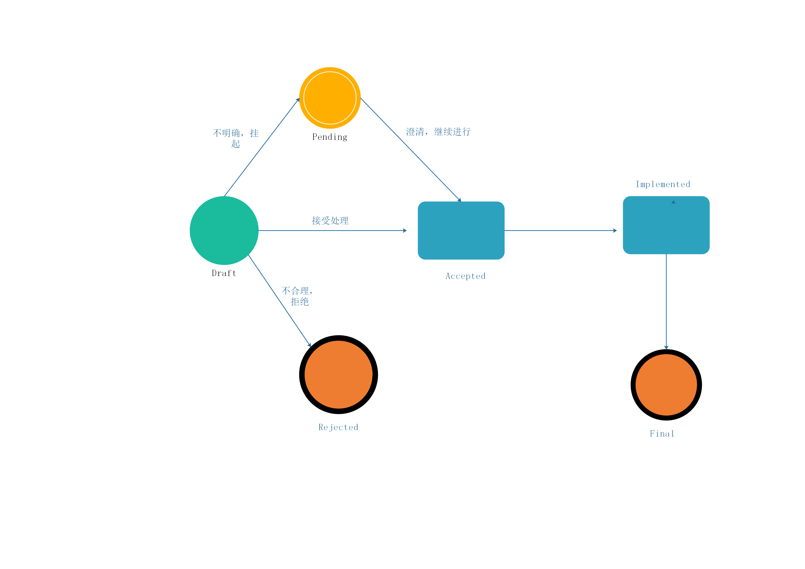

# BIPs
BOTTOS Improvement Proposals(BIP) 是为Bottos区块链的改进计划，社区任何成员以及开发者可以提出问题、建议并提供解决方案。

BIPs指定一整套的改进规则，提出并参与BIPs人员须遵循此规则。

BIPs根据功能分为以下几种类型：
  chainbase: Axxxx
  networks: Bxxxx
  Interface: Cxxxxx
  Wallet: Dxxxx
  Performance: Exxxx
  Contract（BRC）:Fxxxx
 
# BIPs Procedure
  参与提出EIP开发人员，须遵循EIP提出、修改、确认以及公开等多个过程和环节. 
   Draft :    提案处于草案阶段
   Accepted： 提案被接收，处理中，在此期间可修改，并设定收集意见周期。
   Pending：  提案被挂起
   Final：    提案终结，
   Implemented: 提案已实施，针对已经实施的提案可发起先的意见进行修改
   Reject：   提案被拒绝
   
   提案经过下述的状态进行处理。
   
     

# How to contribution

  1: 提交初始提案到本库中的<draft> 目录
  2. 社区定期处理相应的draft提案，并将提案进行社区讨论共识；
  3. 提案接收后，转移到<accepted>目录中，进行社区共识，开启意见收集
  4. 完成讨论，并确定方案的提案进行冻结，进入<final>
  5. 实施的提案将代码提交到<Implemented>
  
  相应的结果将在 eips.bottos.org进行展示和状态跟踪
  
# Eips format

   提案草案提供推荐相应的格式，参考 Eips-mode.md，文件命名建议Eips-Axxx-draft.md，根据上述的分类进行命名
  

  
  

  
  