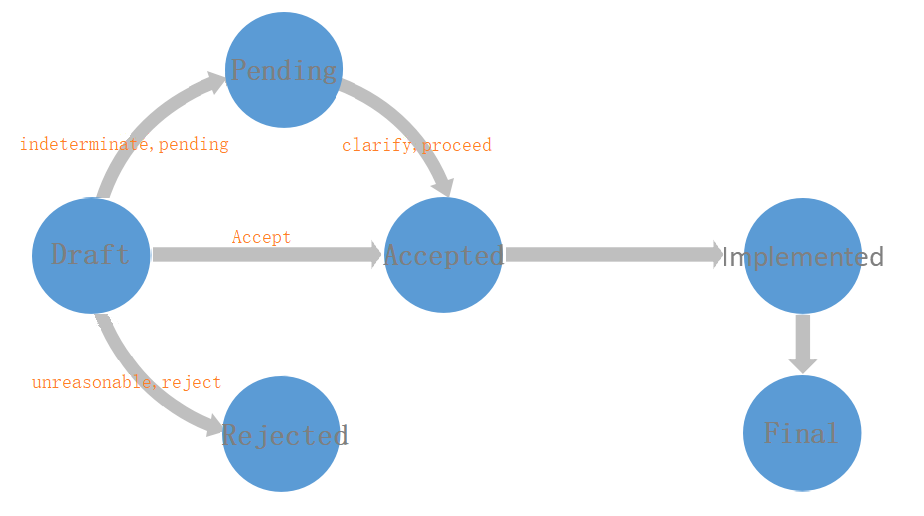

# BIPs

  BOTTOS Improvement Proposals (BIPs) is improvement plan for blockchain of Bottos, any community member or developer can raise the questions and suggestions, then provide the solutions.
 
  BIPs define sort of the improvement rules, the BIPs member must obey the rules.

  According to the functions, BIPs’ types as follow:

   chainbase: Axxxx
  
   networks: Bxxxx
  
   Interface: Cxxxxx
  
   Wallet: Dxxxx
  
   Performance: Exxxx
  
   Contract（BRC）:Fxxxx  
 
# BIPs Procedure
   
  The developer must obey the several procedures when raising, modifying, confirming or opening EIP. 

   Draft : proposal is in a stage of draft
   
   Accepted：proposal is accepted in the process, can be setting the period of collecting suggestion.
   
   Pending： proposal is pending
   
   Final：proposal is terminated
   
   Implemented: proposal is already implemented, for the implemented proposal you can raise the modification suggestion.
   
   Reject： proposal is refused
   
   The proposal will be processing as figure:
   

# How to contribution

  1. submit the initial proposal to the catalog of this repository;
  
  2. community will process the draft proposal regularly, and reach a consensus;
  
  3. accept the proposal, transfer it to the catalog and reach a community consensus, then open the suggestion collection;
  
  4. finish the discussion and lock the confirmed proposal;
  
  5.the implemented proposal will submit the code to repository.
  
  The corresponding result will be showed in eips.bottos.org and tracked.
  
# Eips format

   The draft proposal must have the correct format, please refer to Eips-mode.md. Recommend the name of the draft proposal as Eips-Axxx-draft.md, just like the classification of the above BIPs.
  

 
